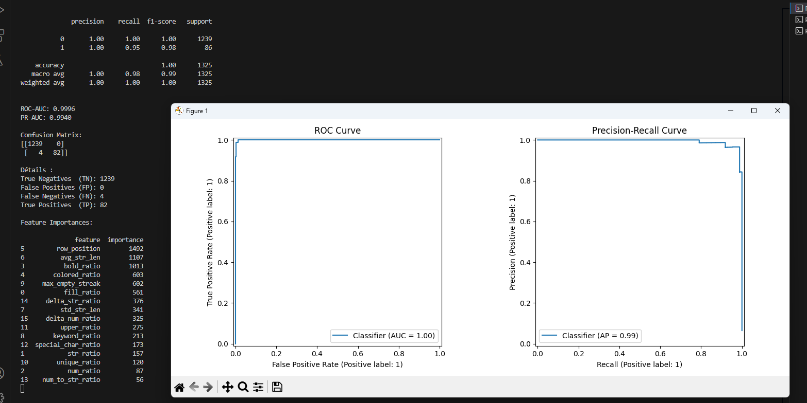

# Random_forest_header_detection
Creation, training of an random forest model to detect the header inside an excel document and comparaison with an Heuristic Scoring Algorithm model to compare which one is more efficient for this task

### Go inside the Heuristic scoring model to see the detail of the algorithm and the random forest model to see how i train and create my AI solution 
## Download and un_zip the package_version_lightlgbm, then follow the installation guide and the model is ready to go on your computer

## Result 

The final model that I use is an lightGBM model (detail in the random_forest_model). 

## Metrics analysis : 

### Class distribution:

Class 0: 1239 samples
Class 1: 86 samples

This is a highly imbalanced dataset (~6.5% positive class), but explanable because we want to predict 1 class which represent only one row per 20 row for each dataset( excel file ) 

#### Class 0 (Negative Class)

Precision: 1.00  -  Recall: 1.00  -  F1-score: 1.00  -  Support: 1239

The model correctly identifies all negative samples. There are zero false positives.

This means the model is extremely conservative in predicting class 1.

#### Class 1 (Positive Class)

Precision: 1.00  -  Recall: 0.95  -  F1-score: 0.98  -  Support: 86

When the model predicts positive → it is always correct. However, it misses 4 true positives, which explains why recall is slightly below 1. This means the model prefers to avoid false positives, even if it misses a few true positives.

This is a very important strategic behavior.

## ROC Curve Analysis

ROC-AUC = 0.9996

The ROC curve is almost perfectly hugging the top-left corner. So in 99.96% of cases, the model ranks a true header above a non-header.

This indicates:

- Excellent separability

- Very strong ranking ability

- Strong feature discrimination power

However:

⚠️ ROC can look overly optimistic on imbalanced datasets.

That’s why PR-AUC matters more here.

## Precision-Recall Curve Analysis

PR-AUC = 0.9940

This is extremely strong for imbalanced classification.

Why PR is more relevant here:

When positives are rare (~6.5%): ROC can be misleading whereas Precision-Recall focuses only on positive class quality

Thus the curve shows:

- Precision stays near 1 for most recall values

- Drops only near extreme threshold

This confirms:

The model has extremely high confidence separation between classes.

## Feature Importance Analysis

The model relies heavily on structural formatting features, not just content. The top features analyse the this row parameters : 

- Position-based patterns

- Formatting patterns (bold, color)

- Structural irregularities (empty streaks)

- Character distribution ratios

This means the model is learning the layout logic of Excel sheets, not specific words.

# Conclusion 
The model demonstrates near-perfect discrimination capacity (ROC-AUC = 0.9996) and extremely strong precision-recall balance (PR-AUC = 0.994), despite significant class imbalance (6.5% positive class).
The classifier prioritizes precision (no false positives) while maintaining high recall (95%), making it robust for structured header detection tasks.
Feature importance analysis confirms that the model leverages structural Excel features rather than lexical memorization, which supports cross-file generalization.
However, due to near-perfect performance metrics, further validation on fully unseen files is necessary to rule out potential data leakage or positional bias overfitting.

After implementing GroupKFold cross-validation and evaluating on completely unseen Excel files, model performance slightly decreased but remained strong (ROC-AUC = 0.998, PR-AUC = 0.981). The slight recall reduction (0.88 on positive class) confirms realistic generalization behavior rather than overfitting. The model maintains near-perfect precision while demonstrating stable performance across validation folds, indicating strong structural learning rather than dataset memorization.

And in comparaison to the Heuristic algorithm, i did run this two solution on an dataset of 50 excel file and the result where te same for the two solution. 
